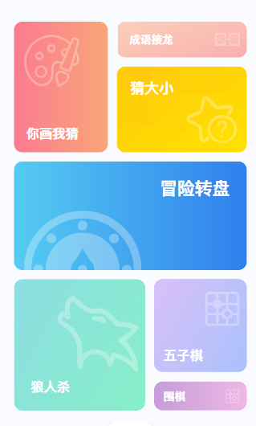
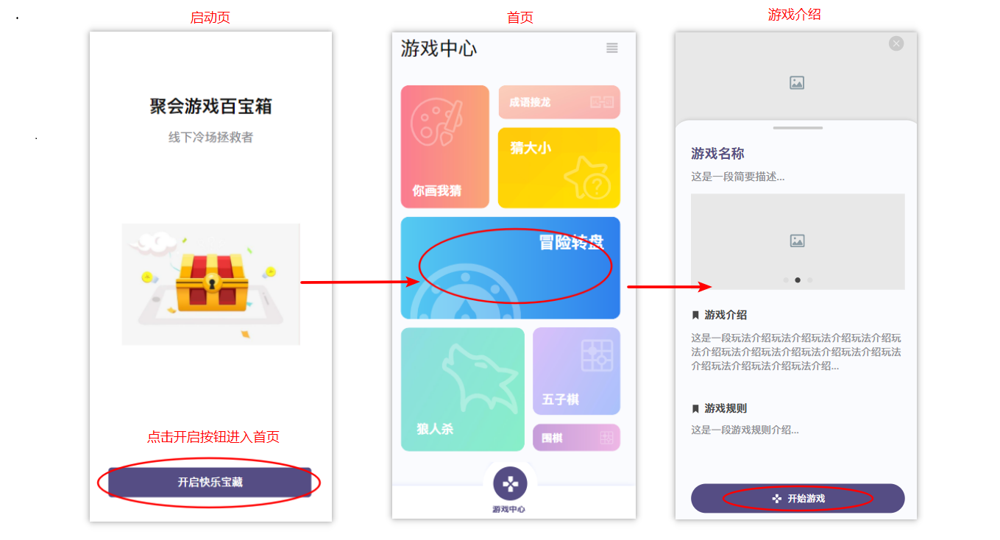

# 《UI设计》

## 构图

由于我们的应用是聚合多个游戏组成的，所以应用的首页是多个应用选项卡，由于采用那种每个卡片大小一样的设计看起来会很死板生硬，所以我们的采用的是大小不一的设计。这样看起来会生动多样一点。

## 配色

在配色上，我们为每个卡片采用不同的颜色，皆为比较活波的颜色。

## 动效

从启动页或者其他页面进入到主页时，主页的卡片呈现是从外部从中间聚拢，看起来更自然。

## 操作流程

